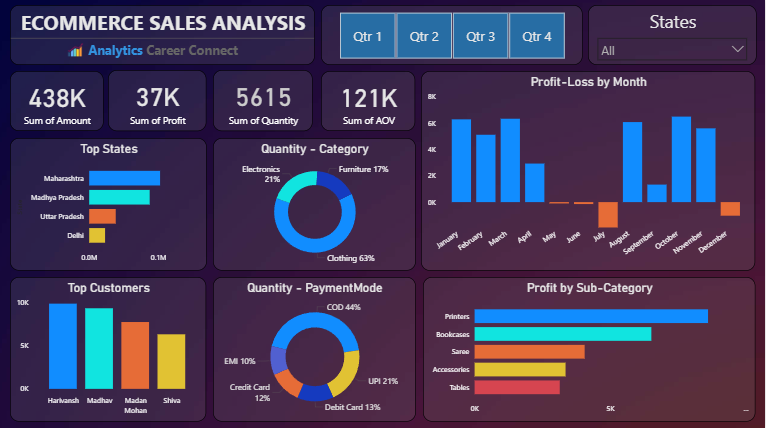

# E-Commerce Sales Analysis Dashboard 📊💰

## Project Overview
This project analyzes e-commerce sales data using **Microsoft Power BI** to create an interactive dashboard with actionable insights. The analysis covers sales metrics, regional performance, customer segments, and payment trends from the provided dataset. It showcases skills in **Power BI**, **data analysis**, and **dashboard development**, making it a valuable addition to my portfolio for roles in MIS, business intelligence, or data analytics.

---

## Dataset Description
The dataset consists of two CSV files:

- **Orders.csv**: Contains order details including Order ID, Order Date, Customer Name, State, and City.
  - Sample Data: B-26055, 10-03-2018, Harivansh, Uttar Pradesh, Mathura.
  - Insight: Covers multiple Indian states with varying customer and order distributions.
- **Details.csv**: Contains sales details including Order ID, Amount, Profit, Quantity, Category, Sub-Category, and Payment Mode.
  - Sample Data: B-25681, 1096, 658, 7, Electronics, Electronic Games, COD.
  - Categories: Clothing, Electronics, Furniture, etc.
  - Sub-Categories: Saree, Printers, Bookcases, etc.
  - Data Insight: Reflects a mix of profitable and loss-making transactions, with total Amount: 438K, Profit: 37K, Quantity: 5,615, and AOV: 121K.

---

## Tools and Technologies
- **Microsoft Power BI**: Used for data modeling, DAX calculations, visualizations, and interactive dashboard development.
- **CSV Files**: Raw data files (`Orders.csv` and `Details.csv`) processed in Power BI.

---

## What I Did in This Project
This project follows a structured approach to analyzing e-commerce sales data using Power BI. Here’s a detailed breakdown:

### 1. Data Preparation
- Imported `Orders.csv` and `Details.csv` into Power BI and cleaned the dataset for analysis.

### 2. Data Exploration
- Analyzed sales distribution across states, categories, and payment modes.
- Identified key metrics like total sales, profit, and top contributors.

### 3. Dashboard Development
- Created DAX measures (e.g., Total Amount, Sum of Profit by State) and applied filters for dynamic exploration.
- Designed an interactive dashboard with visualizations like bar charts, pie charts, and maps, captured in `Dashboard.PNG`. Note: Orange and red colors in charts (except Profit-Loss by Month) are used for aesthetic purposes and do not indicate losses.

### 4. Insights Generation
- Extracted trends such as top states, customer performance, and payment mode preferences.
- Embedded findings in the Power BI dashboard for easy reference.

### Key Output
The project delivers a comprehensive Power BI dashboard with actionable insights, included as `E-Commerce Sales Analysis.pbix`.

---

## Results and Insights
### Overall Sales Performance
- **Sales Overview**: Total sales amount of 438K with a profit of 37K across 5,615 units sold.
- **Top States**: Maharashtra, Madhya Pradesh, Uttar Pradesh, and Delhi lead in sales.
- **Payment Trends**: COD (44%) dominates, followed by UPI (21%) and Debit Card (13%).
- **Profit-Loss by Month**: Losses observed only in May, June, July, and December; other months show profits.

### Category and Product Insights
- **Category Distribution**: Clothing (63%), Electronics (30%), and Furniture (7%) by quantity.
- **Profit Trends**: All categories (Clothing, Electronics, Furniture) show positive sales and profit overall, with sub-categories like Printers and Bookcases performing strongly.

### Geographic and Customer Insights
- **Regional Distribution**: Maharashtra exceeds 20% of sales, with states like Uttar Pradesh and Madhya Pradesh also significant.
- **Top Customers**: Harivansh, Madhav,Madan Mohan, and Shiva are top contributors by profit.

### Business Implications
- **Category Optimization**: Focus on high-profit sub-categories like Printers and maintain strong performers across all categories.
- **Regional Strategy**: Target underperforming states with tailored marketing.
- **Payment Strategy**: Promote COD and UPI for higher adoption.
- **Seasonal Adjustment**: Address losses in May, June, July, and December with targeted strategies (e.g., promotions or inventory adjustments).

---

## Project Structure
- **Orders.csv**: Raw order dataset with customer and location details.
- **Details.csv**: Raw sales dataset with transaction metrics.
- **E-Commerce Sales Analysis.pbix**: Full Power BI report with dashboard and DAX measures.
- **Dashboard.PNG**: Screenshot of the interactive dashboard view.

---

## Skills Demonstrated
This project highlights my ability to:
- Use **Microsoft Power BI** for data modeling and interactive reporting.
- Build dashboards with filters, slicers, and advanced visualizations.
- Analyze sales data to derive actionable insights.

---

## Why This Project Matters
For recruiters, this project showcases my expertise in **Power BI** and **data-driven decision-making**, key for MIS or analytics roles. For others, it provides a practical example of e-commerce sales analysis using Power BI.

---

## How to Replicate the Analysis
1. **Open the PBIX File**:
   - Open `E-Commerce Sales Analysis.pbix` in Power BI Desktop (latest version).
2. **Explore the Dashboard**:
   - Use filters (e.g., Quarters, States) to explore sales metrics.
3. **Review Insights**:
   - Check visualizations for trends and regional performance; note that orange and red colors (except in Profit-Loss by Month) are aesthetic choices.

---

## Contact Me
For questions or collaboration, reach out to:
- **GitHub**: [16parmindersingh](https://github.com/16parmindersingh)
- **Email**: [sparminder1608@gmail.com](mailto:sparminder1608@gmail.com)
- **LinkedIn**: [16parmindersingh](https://www.linkedin.com/in/16parmindersingh)

---

Thank you for checking out my project! I’m eager to enhance my data analytics skills further. 🚀
