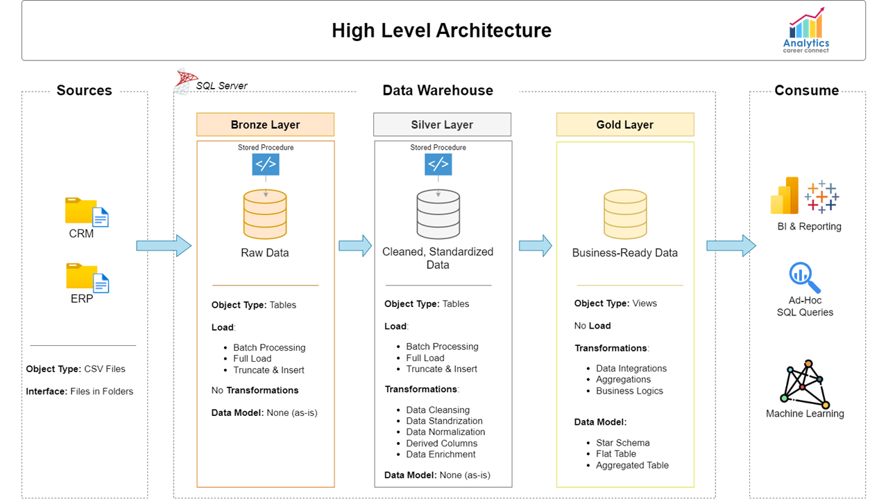
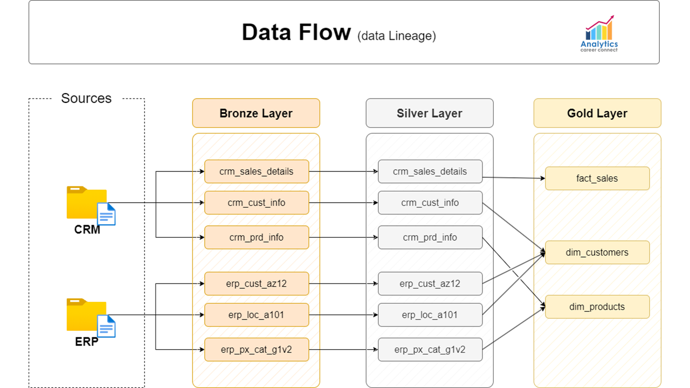
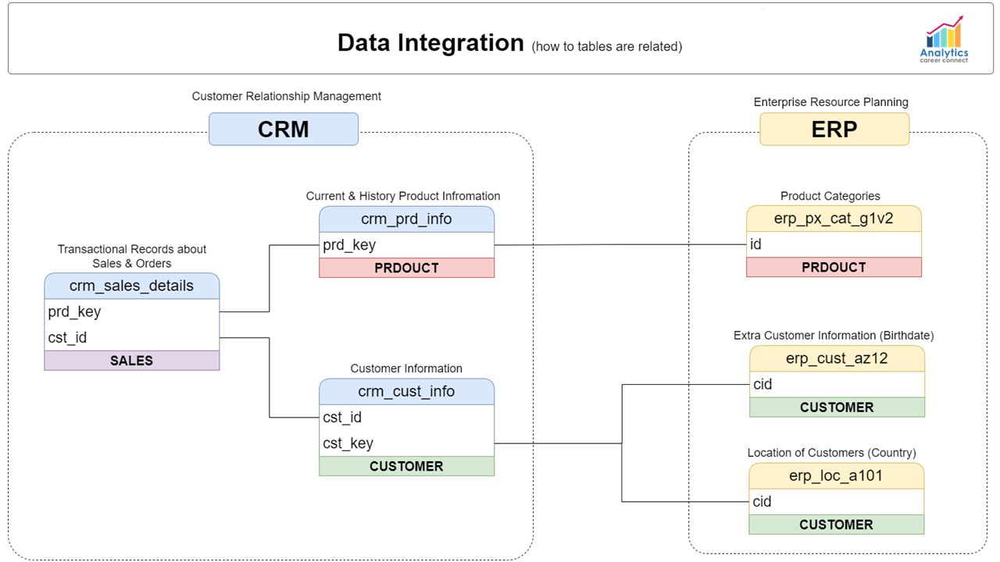
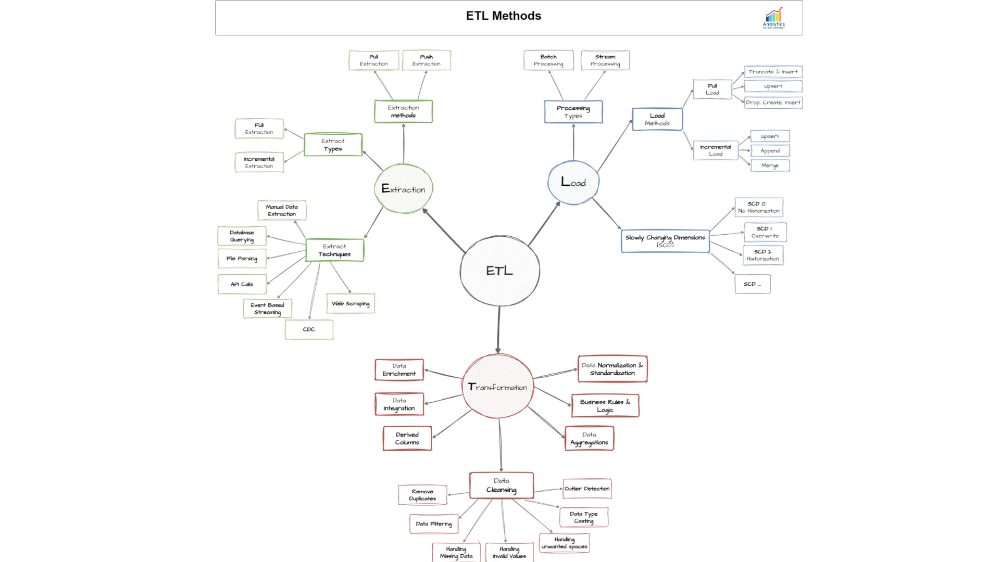
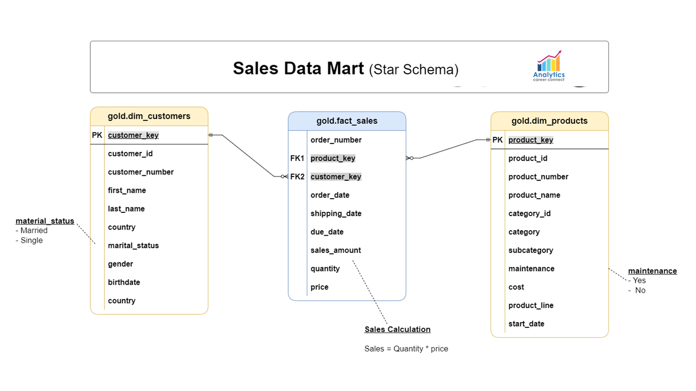

# 🏗️ Medallion SQL Data Warehouse Project

## 📘 Overview
This project demonstrates a **Medallion Architecture** implementation in **SQL Server** for building a scalable data warehouse from raw CRM and ERP CSV sources.  
It processes sales and customer data through layered ETL pipelines:

- **Bronze Layer:** Raw ingestion (as-is data)  
- **Silver Layer:** Cleansed and standardized (deduplication, normalization, derivations)  
- **Gold Layer:** Business-ready star schema (dimensions and facts for BI/ML)

### 🔑 Key Features
- Bulk loading with error handling and logging  
- Transformations: data cleansing, integration (CRM/ERP joins), and quality checks  
- Outputs: Views for analytics (e.g., sales by customer/product)

Built for **MIS Analytics Portfolio** — showcasing SQL ETL, data modeling, and data quality practices.  
Inspired by **Azure Databricks Medallion** but adapted for **on-prem SQL Server**.

---

## 📂 Project Structure
```
Medallion-SQL-Data-Warehouse-Project/
├── README.md                 # This file
├── datasets/                 # Raw CSV sources (no README)
│   ├── source_crm/
│   │   ├── cust_info.csv
│   │   ├── prod_info.csv
│   │   └── sales_details.csv
│   └── source_erp/
│       ├── CUST_A12.csv
│       ├── LOC_A10.csv
│       └── PX_CAT_G1V2.csv
├── docs/                     # Diagrams (referenced here)
│   ├── ETL.png
│   ├── data_architecture.png
│   ├── data_flow.png
│   ├── data_integration.png
│   └── data_model.png
├── scripts/                  # ETL scripts
│   ├── bronze/               # Raw load
│   │   ├── ddl_bronze.sql
│   │   └── proc_load_bronze.sql
│   ├── silver/               # Cleansing
│   │   ├── 1_cleaning_bronze_crm_cust_info.sql
│   │   ├── 2_cleaning_bronze_crm_prd_info.sql
│   │   ├── 3_cleaning_bronze_crm_sales_details.sql
│   │   ├── 4_cleaning_bronze_erp_cust_a12.sql
│   │   ├── 5_cleaning_bronze_erp_loc_a10.sql
│   │   ├── 6_cleaning_bronze_erp_px_cat_giv2.sql
│   │   ├── ddl_silver.sql
│   │   └── proc_load_silver.sql
│   ├── gold/                 # Star schema views
│   │   ├── 1_join_tables_for_gold_dim_customers.sql
│   │   ├── 2_join_tables_for_gold_dim_products.sql
│   │   ├── 3_join_tables_for_gold_fact_sales.sql
│   │   └── ddl_gold.sql
│   └── init_database.sql     # Setup DB/schemas
└── tests/                    # Data quality checks
    ├── quality_checks_gold.sql
    └── quality_checks_silver.sql
```

---

## ⚙️ Prerequisites
- **SQL Server:** 2019+  
- **Client Tools:** Management Studio or Azure Data Studio  
- **Local Setup:** Clone repo; update CSV paths in `scripts/bronze/proc_load_bronze.sql`  
- **Permissions:** DB create/drop rights (script warns on drop)  
- **Optional Tools:** Power BI for Gold views  

⚠️ **Warning:** Running `init_database.sql` drops the `DataWarehouse` DB if it exists — backup first!

---

## 🚀 Quick Start

### 1️⃣ Initialize Database
```sql
:r scripts/init_database.sql
```
Creates the `DataWarehouse` DB and schemas (`bronze`, `silver`, `gold`).

---

### 2️⃣ Load Bronze (Raw)
```sql
:r scripts/bronze/ddl_bronze.sql
EXEC bronze.load_bronze;
```
📄 Details in `scripts/bronze/README.md`

---

### 3️⃣ Load Silver (Cleanse)
```sql
:r scripts/silver/ddl_silver.sql
EXEC silver.load_silver;
```
📄 Details in `scripts/silver/README.md` (includes 6 cleaning scripts)

---

### 4️⃣ Build Gold (Star Schema)
```sql
:r scripts/gold/ddl_gold.sql
```
📄 Details in `scripts/gold/README.md` (includes 3 join scripts)

---

### 5️⃣ Run Quality Checks
```sql
:r tests/quality_checks_silver.sql
:r tests/quality_checks_gold.sql
```
📄 Details in `tests/README.md`

---

## 🧩 Diagrams
Below are the key visuals that explain the Medallion pipeline and data flow.  
Click any image on GitHub to view full size.

### 🏗️ High-Level Data Architecture


### 🔄 Data Flow (Lineage)


### 🔗 Data Integration (CRM + ERP)


### 🧱 ETL Pipeline Overview


### 📊 Star Schema (Gold Layer)


---

## 🧪 Data Quality & Validation
- **Silver Checks:** Completeness, duplicates, normalization (e.g., null % <5%)  
- **Gold Checks:** Join integrity, measure accuracy (e.g., no unmatched FKs)  
- Run after each layer; thresholds defined in test scripts.

---

## 🛠️ Notes & Enhancements
- **Scalability:** Parameterize paths, add indexes, or migrate to Azure Synapse  
- **Extensions:** Connect Gold views to Power BI (e.g., Sales Dashboard) or Python ML (e.g., Customer Churn)  
- **License:** MIT — fork/adapt freely for portfolio use  
- **Troubleshooting:** Common issues: file path mismatch or date parsing (`YYYYMMDD` format)

---

## 🙏 Acknowledgments
Inspired by:
- [Databricks Medallion Architecture Documentation](https://learn.microsoft.com/en-us/azure/databricks/)
- **Analytics Career Connect** learning resources

---

## Contact Me
For any questions or collaboration opportunities, please reach out to:
- **GitHub**: [16parmindersingh](https://github.com/16parmindersingh)
- **LinkedIn**: [16parmindersingh](https://www.linkedin.com/in/16parmindersingh)
- **Email**: [sparminder1608@gmail.com](mailto:sparminder1608@gmail.com)

---

Thank you for checking out my project! I’m excited to continue enhancing my MIS analytics skills and applying them to real-world challenges. 🚀
