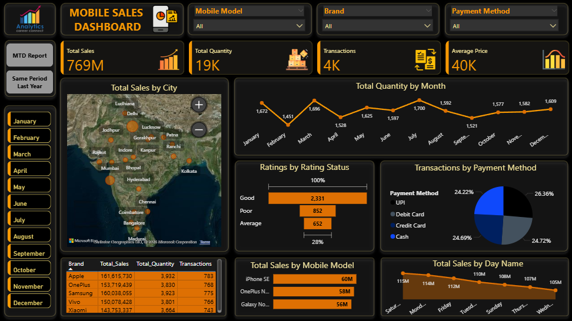

# Mobile Sales Analysis Dashboard 📊📱

## Project Overview
This project analyzes mobile sales data using **Microsoft Power BI** to create an interactive dashboard with actionable insights, focusing on trends, regional performance, and year-over-year comparisons. By processing raw Excel data and leveraging DAX measures, I addressed business questions on sales performance, top brands, and geographic distribution to support strategic decision-making for mobile sales growth and optimization.

This project showcases my skills in **Power BI**, **data analysis**, **DAX programming**, and **dashboard development**, making it a valuable addition to my portfolio for roles in MIS, business intelligence, or data analytics.

---

## Dataset Description
The dataset is a single Excel file containing mobile sales data:

- **Mobile Sales Data.xlsx**: Contains detailed sales information.
  - Columns: `Date`, `Mobile Model`, `Brand`, `Units Sold`, `Price Per Unit`, `Payment Method`, `City`, etc.
  - Sample Data: Entries like 01-01-2023, iPhone SE, Apple, 5 units, $400.00, UPI, Delhi.
  - Data Insight: Covers sales from 2022 to 2023 across multiple cities and brands, supporting temporal and regional analysis.

---

## Tools and Technologies
- **Microsoft Power BI**: Used for data preparation, DAX measures, chart visualization, and interactive dashboard development.
- **Excel**: Raw data file (`Mobile Sales Data.xlsx`) imported and processed in Power BI.

---

## What I Did in This Project
This project follows a structured approach to analyzing mobile sales data using Power BI for MIS reporting. Here’s a detailed breakdown of the steps:

### 1. Data Preparation
- Imported **Mobile Sales Data.xlsx** into Power BI and cleaned the dataset for analysis.

### 2. Data Exploration
- Explored the data to understand sales distribution across brands, models, cities, and time periods from 2022 to 2023.
- Confirmed the dataset supported MTD tracking and year-over-year comparisons.

### 3. Dashboard Development
- Created DAX measures (e.g., Total Sales, Total Quantity, MTD) and applied filters for dynamic exploration by brand, model, and payment method.
- Designed an interactive dashboard with visualizations like maps, bar charts, and line graphs, captured in `Dashboard.PNG`, `MTD Report.PNG`, and `Same Period Last Year.PNG`.

### 4. Insights Generation
- Analyzed results to identify key trends, such as top-performing brands and regional sales leaders, for management decision-making.
- Embedded findings within the Power BI dashboard for easy reference.

### Key Output
The project delivers a comprehensive Power BI dashboard with MTD tracking, year-over-year comparisons, and actionable insights, included in this repository.

---

## Results and Insights
### Overall Sales Performance
- **Sales Growth**: Total sales reached 769M in 2023, showing a 25-30% increase compared to 2022, with strong MTD performance as of October 2025.
- **MTD Trends**: Current month sales show a steady upward trend, indicating robust demand.
- **Year-over-Year**: Sales in 2023 significantly outpace 2022, with same-period-last-year data highlighting consistent growth.

### Brand and Model Insights
- **Top Brands**: Apple (161.6M), Samsung (160M), and OnePlus (153.7M) lead in total sales, reflecting strong market preference.
- **Top Models**: iPhone SE (60M), OnePlus Nord (58M), and Galaxy Note 20 (56M) dominate model sales, suggesting popularity of mid-range devices.

### Geographic Insights
- **Regional Leaders**: Delhi (203.9M) and Mumbai (127.2M) are the top cities, indicating higher demand in urban markets.
- **Daily Patterns**: Sales peak on Mondays (12M) and dip on Sundays (10M), suggesting a strong start-of-week buying trend.

### Payment and Seasonal Insights
- **Payment Preferences**: UPI and credit cards each account for ~24-26% of transactions, showing a shift to digital payments.
- **Seasonal Trends**: Q4 (October-December) shows sales peaks, likely due to festive demand, while Q2 dips suggest a need for promotions.

### Business Implications
- **Brand Focus**: Prioritize marketing for Apple, Samsung, and OnePlus to maintain market leadership.
- **Regional Strategy**: Target underperforming cities with tailored campaigns to boost sales.
- **Inventory Planning**: Align stock with Q4 peaks and address Q2 slumps with strategic promotions.

---

## Project Structure
- **Mobile Sales Data.xlsx**: Raw sales dataset with detailed transaction information.
- **Mobile Sales Analysis.pbix**: Full Power BI report with dashboard, DAX measures, and visualizations.
- **Dashboard.PNG**: Screenshot of the main dashboard view.
- **MTD Report.PNG**: Screenshot of the MTD report view.
- **Same Period Last Year.PNG**: Screenshot of the year-over-year comparison view.

---

## Skills Demonstrated
This project highlights my ability to:
- Use **Microsoft Power BI** for data modeling, including DAX measures and interactive dashboards.
- Analyze sales data to extract actionable insights for strategic decision-support.
- Create visualizations to effectively communicate trends and performance metrics.

---

## Why This Project Matters
For recruiters, this project showcases my expertise in **Power BI**, **DAX programming**, and **interactive reporting**, essential for roles in MIS, business intelligence, or data analytics. It demonstrates my ability to transform raw data into strategic insights.

For others, this project offers a practical example of using Power BI for sales trend analysis and dashboard creation, with applications in retail strategy and performance optimization.

---

## How to Replicate the Analysis
1. **Open the PBIX File**:
   - Open `Mobile Sales Analysis.pbix` in Power BI Desktop (compatible with latest versions).
2. **Explore the Dashboard**:
   - Use filters and slicers to explore sales by brand, model, city, or date range.
3. **Review Insights**:
   - Check MTD and year-over-year visuals and adjust settings in the Filters pane if needed.

---

## Contact Me
For any questions or collaboration opportunities, please reach out to:
- **GitHub**: [16parmindersingh](https://github.com/16parmindersingh)
- **Email**: [sparminder1608@gmail.com](mailto:sparminder1608@gmail.com)
- **LinkedIn**: [16parmindersingh](https://www.linkedin.com/in/16parmindersingh)

---

Thank you for checking out my project! I’m excited to continue enhancing my data analytics skills and applying them to real-world challenges. 🚀
