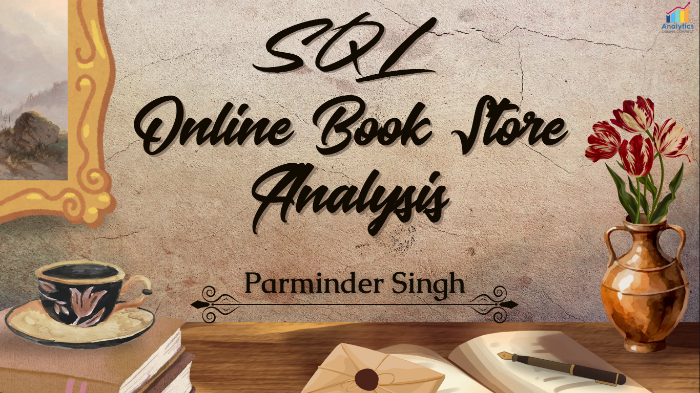
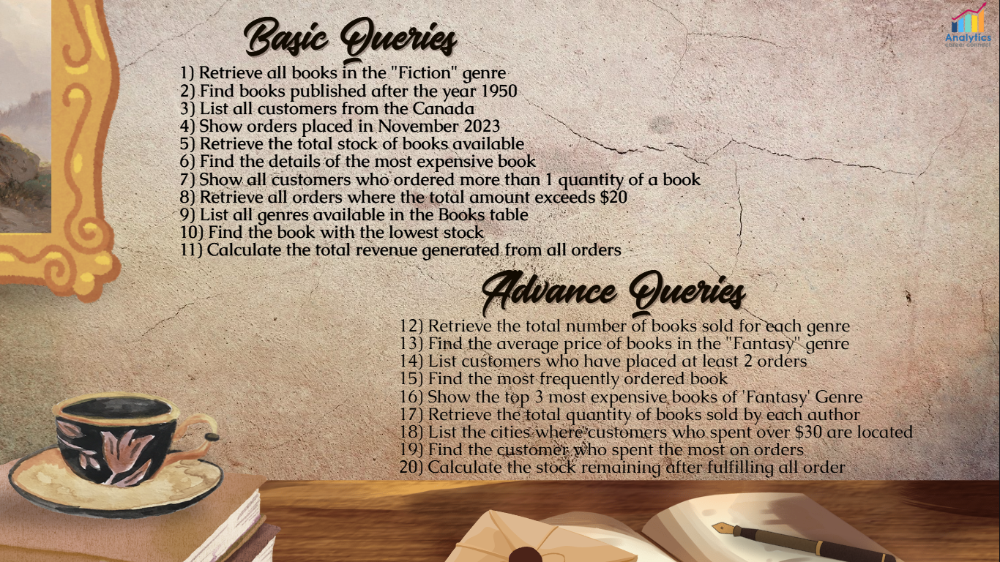

# Online Book Store Analysis 📚💻

## Project Overview
This project focuses on analyzing an online bookstore’s sales, customer, and order data using MySQL to uncover meaningful business insights. The entire workflow—from database creation to SQL-based analysis—demonstrates strong MIS analytics and database management capabilities. It includes raw datasets in CSV format, a comprehensive SQL script containing all analysis queries, and a presentation-style PDF file showcasing each query and its corresponding output.

The goal of this project is to apply structured database techniques for MIS reporting, highlighting data organization, relationship management, and analytical querying through SQL.

---

## Project Previews
**PDF Preview:**  
  
[View Full Project PDF](Online%20Book%20Store%20Analysis.pdf)

**SQL Queries Preview:**  

---

## Dataset Description
The project uses three datasets representing different aspects of the bookstore business:

- **Books.csv** – Contains details of each book such as title, author, category, and price.
- **Customers.csv** – Includes information about customers, including ID, name, and location.
- **Orders.csv** – Records all customer orders, including book IDs, order dates, and quantities purchased.

These datasets together form a relational structure ideal for MIS-style analysis of sales performance, customer trends, and inventory movement.

---

## Tools and Technologies
- **MySQL** – Used for database creation, table setup, data import, and analysis through SQL queries.
- **Microsoft Excel / CSV** – Used as the raw data source for importing into MySQL.
- **PDF Presentation** – `Online Book Store Analysis.pdf` contains all executed queries and their results for documentation and visualization.

---

## What I Did in This Project

### 1. Database Creation and Setup
- Created a new MySQL database named `OnlineBookStore`.
- Designed relational tables for `Books`, `Customers`, and `Orders`.
- Defined primary keys and foreign key constraints to connect tables logically for analysis.

### 2. Data Import
- Imported the raw data from `Books.csv`, `Customers.csv`, and `Orders.csv` into their respective tables.
- Verified data integrity by checking for duplicates, nulls, and inconsistent formats.

### 3. Data Analysis using SQL
- Wrote and executed SQL queries to analyze business metrics, such as:
  - Total sales and revenue calculations.
  - Category-wise and author-wise performance.
  - Customer purchase behavior and frequency.
  - Order trends and high-performing titles.
- Captured all queries and results within the project PDF file for easy visualization.

### 4. Documentation
- Compiled the entire analysis into `Online Book Store Analysis.pdf`, containing all queries, results, and SQL outputs in a structured presentation format.
- Added all supporting files (datasets and SQL script) to the repository for reproducibility.

---

## Project Structure
- `Books.csv` – Raw dataset of all available books in the store.
- `Customers.csv` – Customer database with demographic details.
- `Orders.csv` – Record of all transactions and purchases.
- `SQL OnlineBookStore Analysis.sql` – Contains all SQL queries written and executed for this project.
- `Online Book Store Analysis.pdf` – Full analysis report with queries and results.
- `pdf_Screenshot.png` – Preview of the PDF report.
- `Questions_Screenshot.png` – Screenshot showing all 20 queries from basic to advanced.
- `README.md` – Project documentation file.

---

## Skills Demonstrated
This project showcases my ability to:
- Design and manage relational databases using MySQL.
- Connect and analyze data across multiple tables using joins, subqueries, and aggregate functions.
- Document SQL-based MIS reports with clear structure and professional presentation.
- Translate business data into structured insights using SQL techniques.

---

## Why This Project Matters
For MIS and Data Analyst roles, this project highlights my understanding of data modeling, SQL querying, and relational database management — all essential for transforming raw business data into meaningful insights. It also demonstrates a structured approach to organizing, documenting, and presenting analytical work suitable for MIS reporting environments.

---

## How to Replicate the Analysis
### Download the Repository Files
- Clone or download the repository containing CSVs, SQL script, and PDF.

### Set Up Database
- Open MySQL Workbench and create a new database named `OnlineBookStore`.
- Import the three CSV files (`Books.csv`, `Customers.csv`, `Orders.csv`) into their respective tables.

### Run the Queries
- Open and execute the queries in `SQL OnlineBookStore Analysis.sql`.
- View and compare your outputs with the documented results in `Online Book Store Analysis.pdf`.

---

## Contact Me
For questions, suggestions, or collaboration:

- **GitHub**: [16parmindersingh](https://github.com/16parmindersingh)
- **LinkedIn**: [16parmindersingh](https://www.linkedin.com/in/16parmindersingh)
- **Email**: [sparminder1608@gmail.com](mailto:sparminder1608@gmail.com)

Thank you for checking out my project! This SQL-based MIS analysis demonstrates how structured database querying can power business insights and decision-making. 🚀
