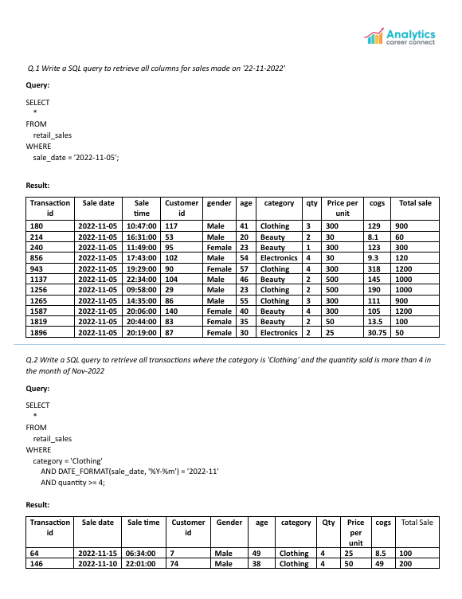

# SQL Retail Sales Analysis 📊💼

## Project Overview
This project analyzes a retail sales dataset using MySQL to derive actionable business insights. The workflow encompasses database creation, data import, and comprehensive SQL-based analysis, showcasing strong MIS analytics and database management skills. It includes raw datasets in CSV format, a detailed SQL script with all analysis queries, and a presentation-style PDF file displaying each query and its output.

The objective is to leverage structured database techniques for MIS reporting, emphasizing data organization, relationship management, and analytical querying through SQL.

---

## Project Preview 
  
[View Full Project PDF](retail_sales_analysis.pdf)

---

## Dataset Description
The project utilizes a single dataset representing retail transaction details:

- **retail_sales.csv** – Contains transaction data including transaction ID, sale date, sale time, customer ID, gender, age, category, quantity, price per unit, cost of goods sold (COGS), and total sale. This dataset forms the foundation for analyzing sales performance, customer demographics, and category trends.

---

## Tools and Technologies
- **MySQL** – Used for database creation, table setup, data import, and analysis through SQL queries.
- **Microsoft Excel / CSV** – Used as the raw data source for importing into MySQL.
- **PDF Presentation** – `retail_sales_analysis.pdf` contains all executed queries and their results for documentation and visualization.

---

## What I Did in This Project

### 1. Database Creation and Setup
- Created a new MySQL database named `retailsalesdb`.
- Designed the `retail_sales` table with appropriate data types and a primary key on `transaction_id`.
- Established data integrity by aligning table structure with the CSV dataset.

### 2. Data Import
- Imported the raw data from `retail_sales.csv` into the `retail_sales` table using `LOAD DATA INFILE`.
- Validated data integrity by checking for duplicates, nulls, and format consistency (e.g., `sale_date` as `dd-mm-yy` converted to `yyyy-mm-dd`).

### 3. Data Analysis using SQL
- Wrote and executed SQL queries to analyze business metrics, such as:
  - Total sales and unique customer counts.
  - Category-wise and date-specific sales performance.
  - Customer demographics (e.g., average age by category).
  - Best-selling months and top customers by total sales.
  - Order distribution by shift and high-value transactions.
- Documented all queries and results in the project PDF for clear visualization.

### 4. Documentation
- Compiled the analysis into `retail_sales_analysis.pdf`, including all queries, results, and SQL outputs in a structured presentation format.
- Added supporting files (dataset and SQL script) to the repository for reproducibility.

---

## Project Structure
- `retail_sales.csv` – Raw dataset of all retail transactions.
- `SQL Retail Store Analysis.sql` – Contains all SQL queries written and executed for this project.
- `retail_sales_analysis.pdf` – Full analysis report with queries and results.
- `pdf_Screenshot.png` – Preview of the PDF report.
- `Questions_Screenshot.png` – Screenshot showing all 10 queries from basic to advanced.
- `README.md` – Project documentation file.

---

## Skills Demonstrated
This project showcases my ability to:
- Design and manage relational databases using MySQL.
- Perform complex SQL queries with joins, window functions, and aggregations.
- Document MIS reports with a clear structure and professional presentation.
- Translate raw sales data into actionable business insights.

---

## Why This Project Matters
For MIS and Data Analyst roles, this project highlights my expertise in data modeling, SQL querying, and relational database management—key skills for transforming raw business data into meaningful insights. It demonstrates a structured approach to organizing, analyzing, and presenting analytical work suitable for MIS reporting environments.

---

## How to Replicate the Analysis
### Download the Repository Files
- Clone or download the repository containing the CSV, SQL script, and PDF.

### Set Up Database
- Open MySQL Workbench and create a new database named `retailsalesdb`.
- Import `retail_sales.csv` into the `retail_sales` table using the provided `CREATE TABLE` and `LOAD DATA INFILE` scripts.

### Run the Queries
- Open and execute the queries in `SQL Retail Store Analysis.sql`.
- View and compare your outputs with the documented results in `retail_sales_analysis.pdf`.

---

## Contact Me
For questions, suggestions, or collaboration:

- **GitHub**: [16parmindersingh](https://github.com/16parmindersingh)
- **LinkedIn**: [16parmindersingh](https://www.linkedin.com/in/16parmindersingh)
- **Email**: [sparminder1608@gmail.com](mailto:sparminder1608@gmail.com)

Thank you for checking out my project! This SQL-based MIS analysis demonstrates how structured database querying can power business insights and decision-making. 🚀
