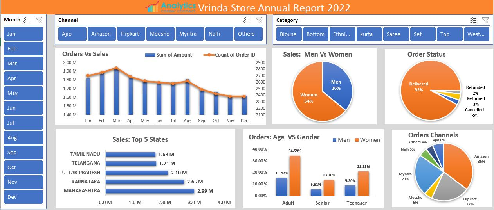

# Vrinda Store Sales Analysis 📊📈

## Project Overview
This project analyzes the annual sales data for Vrinda Store in 2022, focusing on key metrics such as sales by month, gender, age group, state, and sales channels. Using **Microsoft Excel**, I performed data cleaning, created visualizations (e.g., charts and pie charts), and compiled MIS reports to provide actionable insights. The goal was to support strategic business decisions by identifying trends and delivering recommendations to enhance sales performance through management reporting systems.

This project showcases my skills in **data analysis**, **management reporting**, and **business visualization** using Excel, making it a valuable addition to my MIS portfolio.

---

## Dataset Description
The dataset, `Vrinda-Store-Sales-Analysis.xlsx`, contains detailed sales records for Vrinda Store in 2022. It includes approximately 31,047 transactions with the following key sheets:

- **Orders Vs Sales**: Monthly breakdown of sales amount and order count.
- **Men Vs Women**: Total sales by gender.
- **Order Status**: Distribution of order statuses (Delivered, Cancelled, etc.).
- **States**: Sales by top states (e.g., Maharashtra, Karnataka, Uttar Pradesh).
- **Age & Gender**: Order distribution across age groups and genders.
- **Channels**: Sales distribution across channels (e.g., Amazon, Flipkart, Myntra).

### Data Insights
- The dataset covers a full year of sales data with diverse metrics.
- Key findings include a 64% sales contribution from women, top states contributing ~35% of sales, and adults (30-49 yrs) accounting for ~50% of orders.
- The data highlights the dominance of channels like Amazon, Flipkart, and Myntra (~80% of sales).

---

## Tools and Technologies
- **Microsoft Excel**: Used for data analysis, pivot tables, and creating visualizations (charts and pie charts).
- **Word**: Used to compile the insights report (`Annual-Report-Insights.docx`).

---

## What I Did in This Project
This project follows a structured approach to sales data analysis, focusing on exploration, visualization, and MIS reporting. Here’s a detailed breakdown of the steps:

### 1. Data Loading and Exploration
- Imported the raw sales data into Excel and explored it using filters and pivot tables to understand the structure and key metrics.
- Identified key variables such as sales amount, order count, gender, age group, state, and sales channel.

### 2. Data Cleaning
- Removed any duplicate entries and ensured consistency in data (e.g., state names, channel labels).
- Handled missing values where applicable to prepare the data for analysis.

### 3. Data Visualization
- Created a line chart for "Orders Vs Sales" to track monthly trends for management reporting.
- Generated pie charts for "Sales: Men Vs Women," "Order Status," "Orders: Age Vs Gender," and "Orders Channels" to visualize distributions.
- Used bar charts to highlight the top 5 states by sales.

### 4. Reporting
- Compiled key insights and a final recommendation into `Annual-Report-Insights.docx` based on the visualizations for strategic decision-making.

### Key Output
The dashboard image (`Dashboard.png`) summarizes the analysis with charts, providing a clear visual overview of sales performance for management use.

---

## Results and Insights
- **Gender Distribution**: Women contributed ~64% of total sales, indicating a strong female customer base.
- **Top States**: Maharashtra, Karnataka, and Uttar Pradesh accounted for ~35% of sales, identifying key geographic markets.
- **Age Group**: The adult age group (30-49 yrs) drove ~50% of orders, suggesting a target demographic.
- **Sales Channels**: Amazon, Flipkart, and Myntra dominated with ~80% of sales, highlighting effective distribution channels.
- **Recommendation**: Target women aged 30-49 in top states via ads/offers on Amazon, Flipkart, and Myntra to boost sales.
- **Management Integration**: These insights can be integrated into MIS systems for real-time sales tracking and forecasting.

---

## Project Structure
- `Vrinda-Store-Sales-Analysis.xlsx`: The Excel file containing raw data and analysis sheets.
- `Dashboard.png`: Screenshot of the Excel dashboard summarizing the analysis.
- `Annual-Report-Insights.docx`: Document with key insights and conclusions.

---

## Skills Demonstrated
This project highlights my ability to:
- Perform data analysis and visualization using Excel for management reporting.
- Create actionable business insights from raw sales data for decision-support systems.
- Present findings in a professional report and dashboard format.
- Manage and organize data effectively for MIS portfolio presentation.

---

## Why This Project Matters
For recruiters, this project demonstrates my proficiency in Excel-based data analysis and management reporting, which are essential for roles in MIS, business intelligence, or data analytics. For others, it serves as an example of how to analyze retail sales data to derive strategic recommendations, with applications in sales optimization and business reporting systems.

---

## Contact Me
- **GitHub**: [16parmindersingh](https://github.com/16parmindersingh)
- **LinkedIn**: [16parmindersingh](www.linkedin/in/16parmindersingh)
- **Email**: sparminder1608@gmail.com
## Feel free to reach out for collaboration or questions!

---

Thank you for checking out my project! I’m excited to continue enhancing my MIS skills and applying them to real-world business challenges.
